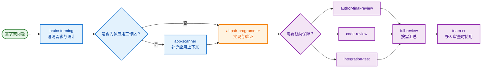
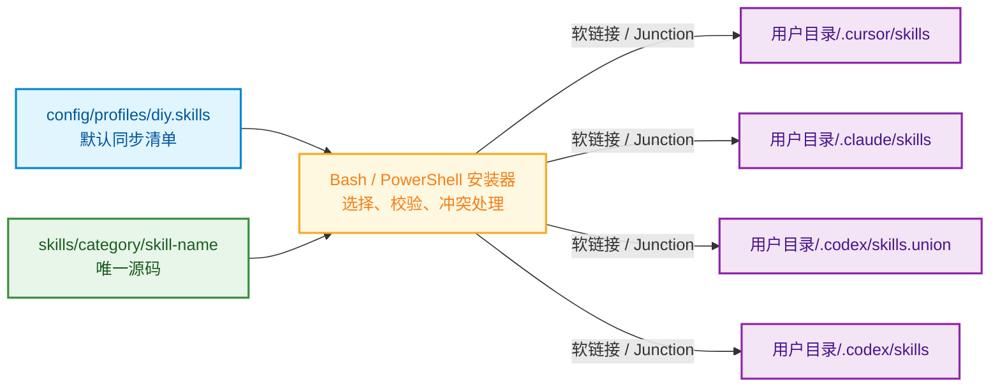
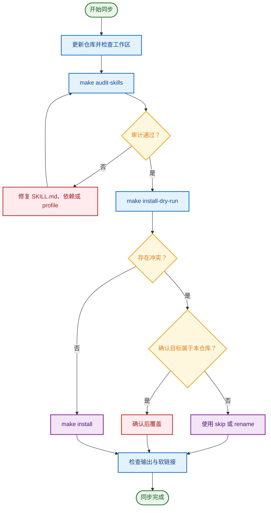

# DIY Agent Skills

这是一个只收录个人维护技能的轻量仓库。所有示例均使用中性命名，不依赖组织专用平台、私有域名、内部凭据或本机绝对路径。

## 技能目录

| 分类 | Skill | 用途 |
|---|---|---|
| Development | `brainstorming` | 开发前澄清需求、比较方案并确认设计 |
| Development | `ai-pair-programmer` | 分析代码库、实现改动并完成验证 |
| Development | `app-scanner` | 扫描多应用工作区并提取业务能力 |
| Review | `author-final-review` | 审查指定作者的最终代码状态 |
| Review | `code-review` | 检查代码质量、安全、性能和架构风险 |
| Review | `integration-test` | 根据变更风险设计集成测试用例 |
| Review | `full-review` | 汇总代码审查、影响分析和测试设计 |
| Review | `team-cr` | 为多人代码审查会议生成讨论清单 |
| Visualization | `diagram-creation` | 创建流程图、架构图、时序图和学习路线 |
| Platform | `git-worktree` | 创建和管理 Git worktree |
| Platform | `skill-usage-tracker` | 记录和查看本地技能使用统计 |

详细触发方式与依赖关系见 [skills/README.md](skills/README.md)。

## Skill 使用链路



## 快速开始

### macOS / Linux

在仓库根目录依次执行：

```bash
make audit-skills
make install-dry-run
make install
```

- `make audit-skills` 检查技能数量、重名和功能重叠。
- `make install-dry-run` 只展示计划，不创建或替换软链接。
- `make install` 同步 `config/profiles/diy.skills` 中的技能。

### Windows PowerShell 5.1+

Windows 不需要安装 `make` 或 Git Bash。在仓库根目录依次执行：

```powershell
powershell -NoProfile -ExecutionPolicy Bypass -File .\install.ps1 preview
powershell -NoProfile -ExecutionPolicy Bypass -File .\install.ps1 install
```

- `preview` 只展示计划，不修改文件。
- `install` 使用目录 Junction 同步技能，不要求管理员权限或开启开发者模式。
- 如果当前 PowerShell 已允许本地脚本，也可以直接执行 `.\install.ps1 preview` 和 `.\install.ps1 install`。

安装器只处理本机已检测到的客户端；未安装的客户端会自动跳过。

## 同步机制

macOS/Linux 使用 `scripts/install_team_bundle.sh`，Windows 使用 `scripts/install_team_bundle.ps1`。两个安装器都以 profile 为入口，校验每个技能目录中的 `SKILL.md`，自动补齐 `depends_on` 依赖，然后将源码目录链接到客户端技能目录。源码仍只保留一份，修改仓库文件后，各客户端会直接读取最新内容。



### 平台与用户目录

安装入口会按平台使用对应的用户目录，不会硬编码用户名：

- Windows 安装器要求 `$env:OS` 为 `Windows_NT`，通过 .NET `UserProfile` 获取当前用户目录，例如 `C:\Users\<用户名>`。
- macOS/Linux 安装器使用 `$HOME`，例如 `/Users/<用户名>` 或 `/home/<用户名>`。
- 在 macOS/Linux 上误运行 `install.ps1` 会直接终止，并提示改用 Bash 安装器。

| 客户端 | macOS / Linux | Windows |
|---|---|---|
| Cursor | `$HOME/.cursor/skills` | `C:\Users\<用户名>\.cursor\skills` |
| Claude Code | `$HOME/.claude/skills` | `C:\Users\<用户名>\.claude\skills` |
| Codex | `$HOME/.codex/skills.union`、`$HOME/.codex/skills` | `C:\Users\<用户名>\.codex\skills.union`、`C:\Users\<用户名>\.codex\skills` |

### Make 命令

以下命令适用于 macOS/Linux：

| 命令 | 作用 | 是否修改文件或链接 |
|---|---|---|
| `make install-dry-run` | 预览默认 profile 的同步结果 | 否 |
| `make install` | 同步默认 profile | 是 |
| `make install-force` | 强制覆盖冲突目标 | 是，高风险 |
| `make uninstall` | 卸载本仓库创建的技能软链接 | 是 |
| `make audit-skills` | 审计数量、重名和功能重叠 | 否 |
| `make remove-skills-dry-run` | 交互预览源码删除计划 | 否 |
| `make remove-skills` | 交互执行源码删除 | 是，高风险 |
| `make stats` | 查看本地技能使用统计 | 否 |
| `make dashboard` | 打开本地统计看板 | 否 |
| `make clean` | 清理 Python 缓存 | 是 |

### Windows PowerShell 命令

| 命令 | 作用 | 是否修改文件或链接 |
|---|---|---|
| `.\install.ps1 preview` | 预览默认 profile 的同步结果 | 否 |
| `.\install.ps1 install` | 同步默认 profile | 是 |
| `.\install.ps1 install -Force` | 强制覆盖冲突目标 | 是，高风险 |
| `.\install.ps1 uninstall` | 卸载本仓库创建的 Junction | 是 |
| `.\install.ps1 preview -Profile <name>` | 预览指定 profile | 否 |

Windows 首版聚焦常用 profile 流程，暂不支持 Bash 安装器的交互选择、重命名安装和自动写回 profile。

### 安装脚本参数

查看实时帮助：

```bash
bash scripts/install_team_bundle.sh --help
```

| 参数 | 说明 |
|---|---|
| `--profile <name>` | 使用 `config/profiles/<name>.skills`，默认 `diy` |
| `--interactive` | 在终端中选择本次同步的技能 |
| `--no-interactive` | 不询问，按 profile 全量处理 |
| `--dry-run` | 只打印计划，不落地 |
| `--uninstall` | 卸载本仓库拥有的软链接，不删除源码 |
| `--skill-conflict overwrite\|skip\|rename\|ask` | 同名 skill 的处理策略 |
| `--conflict ask\|overwrite\|skip` | 已选目标存在时的替换策略 |
| `--persist-extra ask\|always\|never` | 是否把交互追加的 skill 写回 profile |
| `--force` | 不询问并覆盖已有目标，仅在确认目标归属后使用 |

常见用法：

```bash
# 交互选择本次同步项
bash scripts/install_team_bundle.sh --profile diy --interactive

# 同名时保留现有项
bash scripts/install_team_bundle.sh --profile diy --skill-conflict skip

# 同名时使用 skill-name__dev-skill 形式安装
bash scripts/install_team_bundle.sh --profile diy --skill-conflict rename

# 选择未收录的 skill，并自动写回 profile
bash scripts/install_team_bundle.sh --profile diy --interactive --persist-extra always
```

## 同步 SOP



同步后可抽查软链接：

```bash
readlink "$HOME/.cursor/skills/brainstorming"
readlink "$HOME/.claude/skills/brainstorming"
readlink "$HOME/.codex/skills/brainstorming"
```

预期结果应指向当前仓库中的 `skills/development/brainstorming`。未安装或未检测到的客户端没有对应链接是正常现象。

## 卸载与删除

### 普通卸载

只移除指向本仓库的客户端软链接，保留源码和 profile：

```bash
make uninstall
```

Windows 使用：

```powershell
powershell -NoProfile -ExecutionPolicy Bypass -File .\install.ps1 uninstall
```

普通卸载是停止使用技能的首选方式。安装器会核对软链接目标，不会删除不属于本仓库的同名目录。

### 危险操作：删除源码

`scripts/remove_skills.sh` 默认会同时执行三件事：删除客户端软链接、删除仓库中的 skill 源码、从 profile 中移除对应条目。执行前必须使用 `--dry-run`，并在执行后检查 `git diff`。


查看实时帮助：

```bash
bash scripts/remove_skills.sh --help
```

安全示例：

```bash
# 预览删除一个 skill 的完整影响
bash scripts/remove_skills.sh --skills code-review --dry-run --no-interactive

# 只移除 Codex 软链接，不删除源码
bash scripts/remove_skills.sh --skills code-review --targets codex --unlink-only --dry-run

# 预览删除 review 分类中的全部源码、链接和 profile 条目
bash scripts/remove_skills.sh --group review --dry-run --no-interactive
```

> `--repo-only` 会删除源码，`--force` 还可能删除不属于本仓库的同名文件或目录。除非已经确认范围并具备 Git 回退点，否则不要使用。

## Skill 维护 SOP

新增、移动或删除 skill 时：

1. 将源码放在 `skills/<category>/<skill-name>/`，并提供有效的 `SKILL.md`。
2. 检查 frontmatter 中的 `name`、`description` 和 `depends_on`。
3. 更新 `config/profiles/diy.skills` 和技能索引文档。
4. 运行 `make audit-skills`、`make install-dry-run` 和相关脚本检查。
5. 扫描凭据、私有地址、生产数据和本机绝对路径。
6. 查看 `git diff`，确认只包含预期改动后再提交。

## 仓库维护

```bash
make audit-skills       # 检查技能数量、重名和功能重叠
make stats              # 查看本地使用统计
make sync-readme-stats  # 手动刷新 README 使用统计快照
make dashboard          # 打开本地统计看板
make clean              # 清理缓存文件
```

## 常见问题

### 为什么某个客户端没有同步？

安装器只处理已检测到的客户端。先确认客户端或 CLI 已安装，再执行 `make install-dry-run`；Windows 则执行 `.\install.ps1 preview`。macOS/Linux 安装器还要求目标父目录存在。

### Windows 为什么提示脚本被禁止运行？

Windows 执行策略可能阻止直接运行下载的脚本。可以仅为本次进程使用 `powershell -NoProfile -ExecutionPolicy Bypass -File .\install.ps1 preview`，无需永久修改系统执行策略。

### 如何验证 Windows 安装器？

在原生 Windows PowerShell 5.1 或 PowerShell 7 中执行：

```powershell
powershell -NoProfile -ExecutionPolicy Bypass -File .\tests\windows-installer.tests.ps1
```

测试只使用系统临时目录，并覆盖 dry-run、依赖补齐、Junction、冲突、强制覆盖和安全卸载。
非 Windows 开发机安装 PowerShell 7 后，可以追加 `-DryRunOnly` 验证 profile 和依赖逻辑，但 Junction 场景仍需在原生 Windows 运行。

### 为什么 dry-run 显示冲突但没有覆盖？

演练模式不会修改已有目标。先确认目标归属，再选择 `--skill-conflict skip`、`rename` 或显式覆盖策略。

### 修改 skill 后需要重新安装吗？

正常情况下不需要。客户端读取的是指向仓库源码的软链接；只有移动目录、修改 skill 名称或链接丢失时才需要重新同步。

### profile 外的新 skill 为什么没有自动安装？

非交互模式只同步 profile。使用 `--interactive` 选择额外 skill，并按需使用 `--persist-extra always` 写回 profile。

## 目录结构

```text
.
├── install.ps1
├── config/
│   ├── profiles/diy.skills
│   └── skills/repository-skills.manifest.json
├── docs/plans/
├── scripts/
│   ├── install_team_bundle.sh
│   └── install_team_bundle.ps1
├── tests/
└── skills/
    ├── development/
    ├── review/
    ├── visualization/
    └── platform/
```

## 维护原则

- 只保留个人持续维护的技能。
- 示例必须使用中性项目名、域名和数据。
- 禁止提交 token、cookie、密码、内部地址、生产数据和本机绝对路径。
- 删除或移动技能时，同步更新 profile、README、脚本路径和依赖说明。
