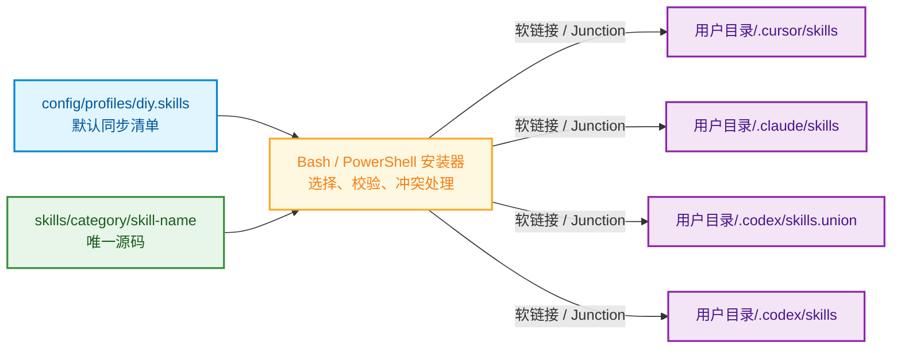
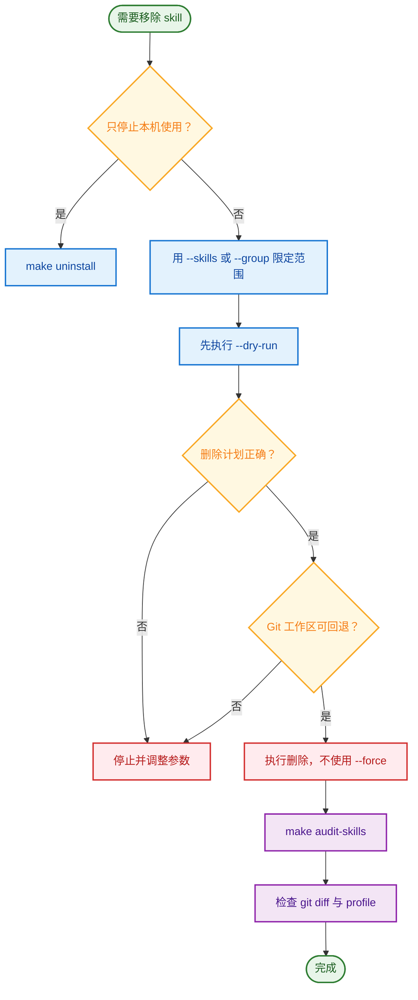
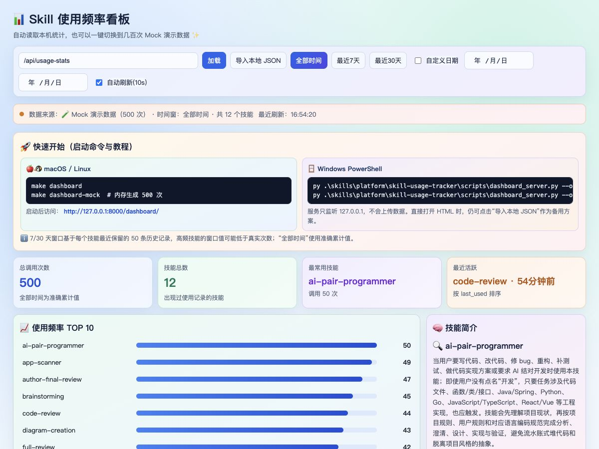

# 🧰✨ DIY Agent Skills · 你的 AI 技能小屋

> ฅ՞•ﻌ•՞ฅ 欢迎来到这间小小的 AI 技能屋！把常用研发能力装进工具箱，需要时轻轻一喊，它们就会跑来帮忙啦～ 🪄💫

这是一个只收录个人维护技能的轻量仓库。每个 Skill 都有自己的拿手好戏，既能独立出场，也能组队完成设计、开发、审查和测试任务 🤝✨ 所有示例均使用中性命名，不依赖组织专用平台、私有域名、内部凭据或本机绝对路径，可以放心阅读和分享 🌱

## 🧩 技能小队集合

先来认识一下住在这里的小伙伴们吧！每一位都有清晰分工，不会一窝蜂抢活干 🐾

| 小队 | Skill | 拿手好戏 |
|---|---|---|
| 🛠️ Development | `brainstorming` | 💭 开发前澄清需求、比较方案并确认设计 |
| 🛠️ Development | `app-scanner` | 🔍 扫描多应用工作区并提取业务能力 |
| 🛠️ Development | `sdd-dev-workflow` | 🧭 从需求出发，扫描代码并生成技术方案、Plan 与 Tasks |
| 🛠️ Development | `ai-pair-programmer` | 🤝 分析代码库、实现改动并完成验证 |
| 🧪 Review | `author-final-review` | 👤 审查指定作者的最终代码状态 |
| 🧪 Review | `code-review` | 🛡️ 检查代码质量、安全、性能和架构风险 |
| 🧪 Review | `integration-test` | 🎯 根据变更风险设计集成测试用例 |
| 🧪 Review | `full-review` | 📦 汇总代码审查、影响分析和测试设计 |
| 🧪 Review | `team-cr` | 👥 为多人代码审查会议生成讨论清单 |
| 🎨 Visualization | `diagram-creation` | 🗺️ 创建流程图、架构图、时序图和学习路线 |
| ⚙️ Platform | `git-worktree` | 🌿 创建和管理 Git worktree |
| ⚙️ Platform | `skill-usage-tracker` | 📊 记录和查看本地技能使用统计 |

想看看它们什么时候会自动出现、彼此怎么组队？详细触发方式与依赖关系都藏在 [skills/README.md](skills/README.md) 里啦 📚✨

## 🗺️ Skill 冒险路线

一项需求从“小脑洞”成长为“放心交付”，通常会沿着下面这条路线一路升级打怪 🎮🌟

```mermaid
flowchart LR
    IDEA(["需求或问题"]) --> DISCOVERY{"需求和方案是否清晰？"}
    DISCOVERY -- 否 --> DESIGN["brainstorming<br/>探索目标与方案"]
    DISCOVERY -- 是 --> SDD["sdd-dev-workflow<br/>需求 → 技术方案 → Plan → Tasks"]
    DESIGN --> SDD
    SDD --> CONTEXT{"是否为多应用工作区？"}
    CONTEXT -- 是 --> SCAN["app-scanner<br/>补充应用与依赖证据"]
    CONTEXT -- 否 --> EVIDENCE["扫描当前仓代码<br/>建立真实工程证据"]
    SCAN --> READY["开发准备包<br/>requirements / design / plan / tasks"]
    EVIDENCE --> READY
    READY --> BUILD["ai-pair-programmer<br/>明确授权后实现与验证"]
    BUILD --> REVIEW{"需要哪类保障？"}
    REVIEW --> AUTHOR["author-final-review"]
    REVIEW --> CODE["code-review"]
    REVIEW --> TEST["integration-test"]
    AUTHOR --> REPORT["full-review<br/>按需汇总"]
    CODE --> REPORT
    TEST --> REPORT
    REPORT --> TEAM["team-cr<br/>多人审查时使用"]

    classDef start fill:#E8F5E9,stroke:#2E7D32,color:#1B5E20,stroke-width:2px;
    classDef design fill:#E3F2FD,stroke:#1976D2,color:#0D47A1,stroke-width:2px;
    classDef build fill:#FFF3E0,stroke:#F57C00,color:#E65100,stroke-width:2px;
    classDef review fill:#F3E5F5,stroke:#8E24AA,color:#4A148C,stroke-width:2px;
    class IDEA start;
    class DISCOVERY,DESIGN,SDD,CONTEXT,SCAN,EVIDENCE,READY design;
    class BUILD build;
    class REVIEW,AUTHOR,CODE,TEST,REPORT,TEAM review;
```



## 🚀 三分钟快速开工

准备好你的小背包了吗？选中自己的操作系统，跟着命令走一遍，很快就能召唤技能小队啦 🎒✨

### 🍎🐧 macOS / Linux

在仓库根目录念出这三条“小咒语”：

```bash
make audit-skills
make install-dry-run
make install
```

- `make audit-skills`：先给技能小队点个名，检查数量、重名和功能重叠 🔍
- `make install-dry-run`：排练一次安装计划，不创建或替换软链接 🎭
- `make install`：正式同步 `config/profiles/diy.skills` 中的技能 🎉

### 🪟💙 Windows PowerShell 5.1+

Windows 小伙伴不需要额外安装 `make` 或 Git Bash，在仓库根目录依次执行下面两步就好啦：

```powershell
powershell -NoProfile -ExecutionPolicy Bypass -File .\install.ps1 preview
powershell -NoProfile -ExecutionPolicy Bypass -File .\install.ps1 install
```

- `preview`：先偷偷看一眼安装计划，不修改任何文件 👀
- `install`：使用目录 Junction 同步技能，不要求管理员权限或开启开发者模式 🪄
- 如果当前 PowerShell 已允许本地脚本，也可以直接执行 `.\install.ps1 preview` 和 `.\install.ps1 install`，少敲一点字更轻松 🐇

看到完成提示后，重新打开客户端，就可以愉快地召唤技能啦 🎊 安装器只处理本机已检测到的客户端；未安装的客户端会乖乖跳过，不会乱动其他目录 🐾

## 🔄✨ 技能同步魔法

macOS/Linux 使用 `scripts/install_team_bundle.sh`，Windows 使用 `scripts/install_team_bundle.ps1`。两个安装器都会拿着 profile 清单逐个确认 `SKILL.md`，再自动叫上 `depends_on` 里的依赖伙伴，最后把源码目录链接到客户端技能目录 🧙‍♀️🔗

源码只住在仓库这一间“小屋”里，客户端通过软链接或 Junction 来串门 🏠 修改仓库文件后，各客户端就能直接读到最新内容，不需要到处复制好多份～



### 🏡🔍 平台与用户目录

不用亲手填写用户名，安装器会自己找到你的用户目录，像一只认路的小信鸽 🕊️

- Windows 安装器要求 `$env:OS` 为 `Windows_NT`，通过 .NET `UserProfile` 获取当前用户目录，例如 `C:\Users\<用户名>`。
- macOS/Linux 安装器使用 `$HOME`，例如 `/Users/<用户名>` 或 `/home/<用户名>`。
- 在 macOS/Linux 上误运行 `install.ps1` 会直接终止，并提示改用 Bash 安装器。

| 客户端 | macOS / Linux | Windows |
|---|---|---|
| Cursor | `$HOME/.cursor/skills` | `C:\Users\<用户名>\.cursor\skills` |
| Claude Code | `$HOME/.claude/skills` | `C:\Users\<用户名>\.claude\skills` |
| Codex | `$HOME/.codex/skills.union`、`$HOME/.codex/skills` | `C:\Users\<用户名>\.codex\skills.union`、`C:\Users\<用户名>\.codex\skills` |

### 🍎🐧 Make 命令小抄

以下命令适用于 macOS/Linux，想做什么直接来这里翻牌子 🎴

| 命令 | 作用 | 是否修改文件或链接 |
|---|---|---|
| `make install-dry-run` | 预览默认 profile 的同步结果 | 否 |
| `make install` | 同步默认 profile | 是 |
| `make install-force` | 强制覆盖冲突目标 | 是，高风险 |
| `make uninstall` | 卸载本仓库创建的技能软链接 | 是 |
| `make audit-skills` | 审计数量、重名和功能重叠 | 否 |
| `make remove-skills-dry-run` | 交互预览源码删除计划 | 否 |
| `make remove-skills` | 交互执行源码删除 | 是，高风险 |
| `make stats` | 查看本地技能使用统计 | 否 |
| `make dashboard` | 打开本地统计看板 | 否 |
| `make dashboard-mock` | 用 500 次内存 Mock 数据预览看板 | 否 |
| `make dashboard-test` | 运行看板服务自动化测试 | 否 |
| `make clean` | 清理 Python 缓存 | 是 |

### 🪟💙 Windows PowerShell 命令小抄

| 命令 | 作用 | 是否修改文件或链接 |
|---|---|---|
| `.\install.ps1 preview` | 预览默认 profile 的同步结果 | 否 |
| `.\install.ps1 install` | 同步默认 profile | 是 |
| `.\install.ps1 install -Force` | 强制覆盖冲突目标 | 是，高风险 |
| `.\install.ps1 uninstall` | 卸载本仓库创建的 Junction | 是 |
| `.\install.ps1 preview -Profile <name>` | 预览指定 profile | 否 |

Windows 首版先把常用 profile 流程照顾得稳稳当当 🫶 暂不支持 Bash 安装器的交互选择、重命名安装和自动写回 profile。

### 🧙‍♂️ Bash 安装器魔法参数

参数有点多也别慌，先让脚本自己递上说明书：

```bash
bash scripts/install_team_bundle.sh --help
```

| 参数 | 说明 |
|---|---|
| `--profile <name>` | 使用 `config/profiles/<name>.skills`，默认 `diy` |
| `--interactive` | 在终端中选择本次同步的技能 |
| `--no-interactive` | 不询问，按 profile 全量处理 |
| `--dry-run` | 只打印计划，不落地 |
| `--uninstall` | 卸载本仓库拥有的软链接，不删除源码 |
| `--skill-conflict overwrite\|skip\|rename\|ask` | 同名 skill 的处理策略 |
| `--conflict ask\|overwrite\|skip` | 已选目标存在时的替换策略 |
| `--persist-extra ask\|always\|never` | 是否把交互追加的 skill 写回 profile |
| `--force` | 不询问并覆盖已有目标，仅在确认目标归属后使用 |

常见搭配已经帮你配好啦：

```bash
# 交互选择本次同步项
bash scripts/install_team_bundle.sh --profile diy --interactive

# 同名时保留现有项
bash scripts/install_team_bundle.sh --profile diy --skill-conflict skip

# 同名时使用 skill-name__dev-skill 形式安装
bash scripts/install_team_bundle.sh --profile diy --skill-conflict rename

# 选择未收录的 skill，并自动写回 profile
bash scripts/install_team_bundle.sh --profile diy --interactive --persist-extra always
```

## 🧭✨ 同步冒险 SOP

安全同步就像闯关：先检查、再预演、确认无误后才正式出发。一路按箭头走，就不容易踩坑啦 🗺️🐾


同步结束后，可以抽查几个软链接，看看技能有没有顺利抵达新家 🔍🏠

```bash
readlink "$HOME/.cursor/skills/brainstorming"
readlink "$HOME/.claude/skills/brainstorming"
readlink "$HOME/.codex/skills/brainstorming"
```

预期结果应指向当前仓库中的 `skills/development/brainstorming`。如果某个客户端尚未安装或没有被检测到，对应链接缺席也是正常的，它只是还没来上班而已 💤

## 🧹🌙 让技能下班：卸载与删除

### 💤 普通卸载

普通卸载只是让技能暂时下班：移除指向本仓库的客户端软链接，但源码和 profile 都会乖乖留在原地 🏠

```bash
make uninstall
```

Windows 使用：

```powershell
powershell -NoProfile -ExecutionPolicy Bypass -File .\install.ps1 uninstall
```

普通卸载是停止使用技能的首选方式。安装器会认真核对软链接目标，不会误删不属于本仓库的同名目录，安全感满满 🛡️✨

### ⚠️ 危险操作：永久删除源码

这里不是让技能“下班”，而是会真的搬空房间。`scripts/remove_skills.sh` 默认会同时执行三件事：删除客户端软链接、删除仓库中的 skill 源码、从 profile 中移除对应条目。执行前必须使用 `--dry-run`，并在执行后检查 `git diff`。



动手前先把帮助说明认真看完：

```bash
bash scripts/remove_skills.sh --help
```

下面是带着安全护盾的示例 🛡️

```bash
# 预览删除一个 skill 的完整影响
bash scripts/remove_skills.sh --skills code-review --dry-run --no-interactive

# 只移除 Codex 软链接，不删除源码
bash scripts/remove_skills.sh --skills code-review --targets codex --unlink-only --dry-run

# 预览删除 review 分类中的全部源码、链接和 profile 条目
bash scripts/remove_skills.sh --group review --dry-run --no-interactive
```

> ⚠️ `--repo-only` 会删除源码，`--force` 还可能删除不属于本仓库的同名文件或目录。除非已经确认范围并具备 Git 回退点，否则不要使用。危险按钮不可以因为好奇就随便按！

## 🛠️🌟 Skill 维护 SOP

想邀请新伙伴入住，或者帮旧伙伴搬家时，请按这份清单逐项确认 🏡📋

1. 将源码放在 `skills/<category>/<skill-name>/`，并提供有效的 `SKILL.md`。
2. 检查 frontmatter 中的 `name`、`description` 和 `depends_on`。
3. 更新 `config/profiles/diy.skills` 和技能索引文档。
4. 运行 `make audit-skills`、`make install-dry-run` 和相关脚本检查。
5. 扫描凭据、私有地址、生产数据和本机绝对路径。
6. 查看 `git diff`，确认只包含预期改动后再提交。

## 🧺✨ 仓库日常维护

偶尔帮技能小屋打扫一下，它就能一直保持轻巧又精神：

```bash
make audit-skills       # 检查技能数量、重名和功能重叠
make stats              # 查看本地使用统计
make sync-readme-stats  # 手动刷新 README 使用统计快照
make dashboard          # 打开本地统计看板
make dashboard-mock     # 用 500 次内存 Mock 数据预览看板
make dashboard-test     # 检查本地服务、Mock 和安全边界
make clean              # 清理缓存文件
```

## 📊🌸 技能热度小看板

想看看哪些 Skill 最近最勤快？让小看板把一串串数字变成闪闪发光的排行榜吧～ ✨🐾

### 🍬🌈 看板长这样



软乎乎的淡彩卡片会把调用总量、活跃 Skill 和最近使用时间轻轻装好，谁最勤快一眼就能发现～ 🧁✨ 使用频率榜只展示 TOP 10，热闹但不拥挤！

### 🍎🐧 macOS / Linux

```bash
# 读取真实统计
make dashboard

# 用 500 次模拟调用预览完整效果
make dashboard-mock

# 想让数据更热闹一点也可以
MOCK_COUNT=800 make dashboard-mock
```

### 🪟💫 Windows PowerShell

```powershell
# 读取真实统计
py .\skills\platform\skill-usage-tracker\scripts\dashboard_server.py --open

# 用 500 次模拟调用预览完整效果
py .\skills\platform\skill-usage-tracker\scripts\dashboard_server.py --open --mock-count 500
```

如果系统没有 `py` 命令，把它换成 `python` 就好啦。启动后访问 `http://127.0.0.1:8000/dashboard/`，按 `Ctrl+C` 可以让看板乖乖下班 🌙

真实模式会自动读取当前用户目录中的统计文件：

- macOS / Linux：`~/usage_stats.json`
- Windows：`$env:USERPROFILE\usage_stats.json`

🔒 本地服务默认只监听 `127.0.0.1`，不会上传统计，也不会开放整个仓库。Mock 数据只在内存中生成，关掉服务就会消失，绝不会覆盖真实统计文件，可以放心大胆地把数字拉到几百次！

如果直接双击 HTML 以 `file://` 打开，浏览器仍然不能自动读取用户目录；这时可以点击页面里的“导入本地 JSON”作为备用小门 🚪

> ℹ️ “全部时间”使用准确累计值；7/30 天窗口基于每个技能最近保留的 50 条历史记录，高频技能的窗口值可能低于真实次数。

## 🙋💡 常见问题小剧场

### 🐾 为什么某个客户端没有同步？

它可能只是还没被安装器认出来～先确认客户端或 CLI 已安装，再执行 `make install-dry-run`；Windows 则执行 `.\install.ps1 preview`。macOS/Linux 安装器还要求目标父目录存在。

### 🪟 Windows 为什么提示脚本被禁止运行？

别紧张，这是 Windows 执行策略在认真守门 🛡️ 可以仅为本次进程使用 `powershell -NoProfile -ExecutionPolicy Bypass -File .\install.ps1 preview`，无需永久修改系统执行策略。

### 🧪 如何验证 Windows 安装器？

在原生 Windows PowerShell 5.1 或 PowerShell 7 中执行：

```powershell
powershell -NoProfile -ExecutionPolicy Bypass -File .\tests\windows-installer.tests.ps1
```

测试只在系统临时目录搭建一个“小舞台” 🎭 并覆盖 dry-run、依赖补齐、Junction、冲突、强制覆盖和安全卸载。
非 Windows 开发机安装 PowerShell 7 后，可以追加 `-DryRunOnly` 验证 profile 和依赖逻辑，但 Junction 场景仍需在原生 Windows 运行。

### 🎭 为什么 dry-run 显示冲突但没有覆盖？

因为它只是在认真彩排，不会真的动手修改已有目标～先确认目标归属，再选择 `--skill-conflict skip`、`rename` 或显式覆盖策略。

### 🔄 修改 skill 后需要重新安装吗？

正常情况下不需要。客户端会沿着软链接直接读取仓库源码，改完立刻就能看到新内容 ✨ 只有移动目录、修改 skill 名称或链接丢失时才需要重新同步。

### 🐣 profile 外的新 skill 为什么没有自动安装？

它还没有拿到正式入队名额～非交互模式只同步 profile。使用 `--interactive` 选择额外 skill，并按需使用 `--persist-extra always` 写回 profile。

## 🏡📦 技能小屋结构

```text
.
├── install.ps1
├── config/
│   ├── profiles/diy.skills
│   └── skills/repository-skills.manifest.json
├── docs/plans/
├── scripts/
│   ├── install_team_bundle.sh
│   └── install_team_bundle.ps1
├── tests/
└── skills/
    ├── development/
    ├── review/
    ├── visualization/
    └── platform/
```

## 🌱💖 小屋维护原则

- 🪴 只保留个人持续维护的技能，让每位伙伴都有人照顾。
- 🧸 示例必须使用中性项目名、域名和数据，公开分享也安心。
- 🔐 禁止提交 token、cookie、密码、内部地址、生产数据和本机绝对路径。
- 🧭 删除或移动技能时，同步更新 profile、README、脚本路径和依赖说明。

保持小而美、可复用、可放心分享，让这间技能小屋一直热热闹闹地运转下去吧 ฅ՞•ﻌ•՞ฅ ✨
