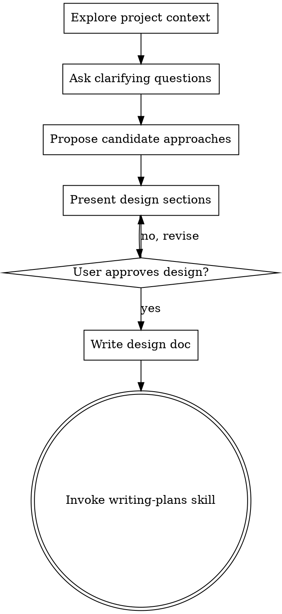

# Brainstorming Ideas Into Designs

## 执行前记录（强制）

执行本技能前，必须先记录一次使用：

```bash
scripts/skill-stats record --skill "brainstorming" --context "需求分析与方案设计"
```

若当前场景更贴切，也可替换 `--context`，但不得跳过记录步骤。

## Overview

Help turn ideas into fully formed designs and specs through natural collaborative dialogue.

Start by understanding the current project context, then ask questions one at a time to refine the idea. Once you understand what you're building, present the design and get user approval.

## Anti-Pattern: "This Is Too Simple To Need A Design"

Every project goes through this process. A todo list, a single-function utility, a config change - all of them. "Simple" projects are where unexamined assumptions cause the most wasted work. The design can be short (a few sentences for truly simple projects), but you MUST present it and get approval.

## Checklist

You MUST create a task for each of these items and complete them in order:

1. Explore project context - check files, docs, recent commits
2. Ask clarifying questions - one at a time, understand purpose/constraints/success criteria
3. Propose candidate approaches dynamically - number based on complexity/uncertainty, with trade-offs and recommendation
4. Present design - in sections scaled to complexity, get user approval after each section
5. Write design doc - save to `docs/plans/YYYY-MM-DD-<topic>-design.md` and commit
6. Transition to implementation - invoke `writing-plans` skill to create implementation plan

## Process Flow



The terminal state is invoking `writing-plans`. Do NOT invoke `frontend-design`, `mcp-builder`, or any other implementation skill. The ONLY skill you invoke after brainstorming is `writing-plans`.

## The Process

### Understanding the idea

- Check out the current project state first (files, docs, recent commits)
- Ask questions one at a time to refine the idea
- Prefer multiple choice questions when possible, but open-ended is fine too
- Only one question per message; if a topic needs more exploration, break it into multiple questions
- Focus on understanding purpose, constraints, success criteria

### Exploring approaches

- Think through the problem based on answers and constraints before responding
- Propose approach count dynamically:
  - Simple/low-uncertainty: 1-2 options
  - Normal: 2-3 options
  - Complex/high-uncertainty: 3-5 options
- Present options conversationally with your recommendation and reasoning
- Lead with your recommended option and explain why

### Presenting the design

- Once you believe you understand what you're building, present the design
- Scale each section to complexity: a few sentences if straightforward, up to 200-300 words if nuanced
- Ask after each section whether it looks right so far
- Cover architecture, components, data flow, error handling, testing
- Be ready to go back and clarify if something doesn't make sense

## After The Design

### Documentation

- Write the validated design to `docs/plans/YYYY-MM-DD-<topic>-design.md`
- Use `elements-of-style:writing-clearly-and-concisely` skill if available
- Commit the design document to git

### Implementation

- Invoke `writing-plans` skill to create a detailed implementation plan
- Do NOT invoke any other skill; `writing-plans` is the next step

## Key Principles

- One question at a time: do not overwhelm with multiple questions
- Multiple choice preferred: easier to answer than open-ended when possible
- YAGNI ruthlessly: remove unnecessary features from all designs
- Explore alternatives: choose option count based on complexity, not a fixed number
- Incremental validation: present design, get approval before moving on
- Be flexible: go back and clarify when something does not make sense
