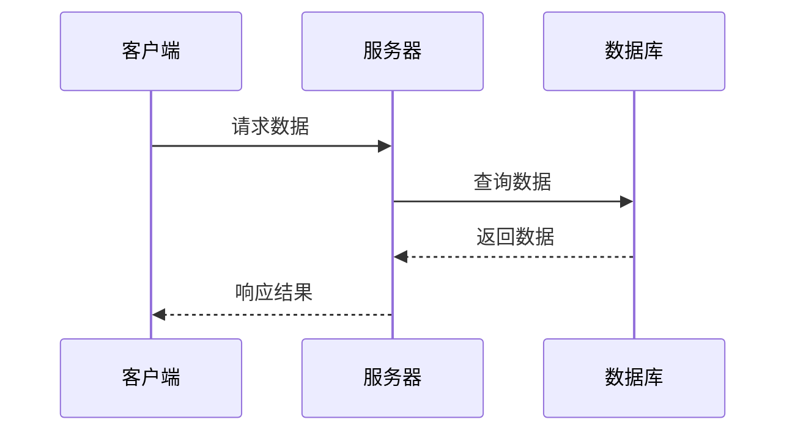
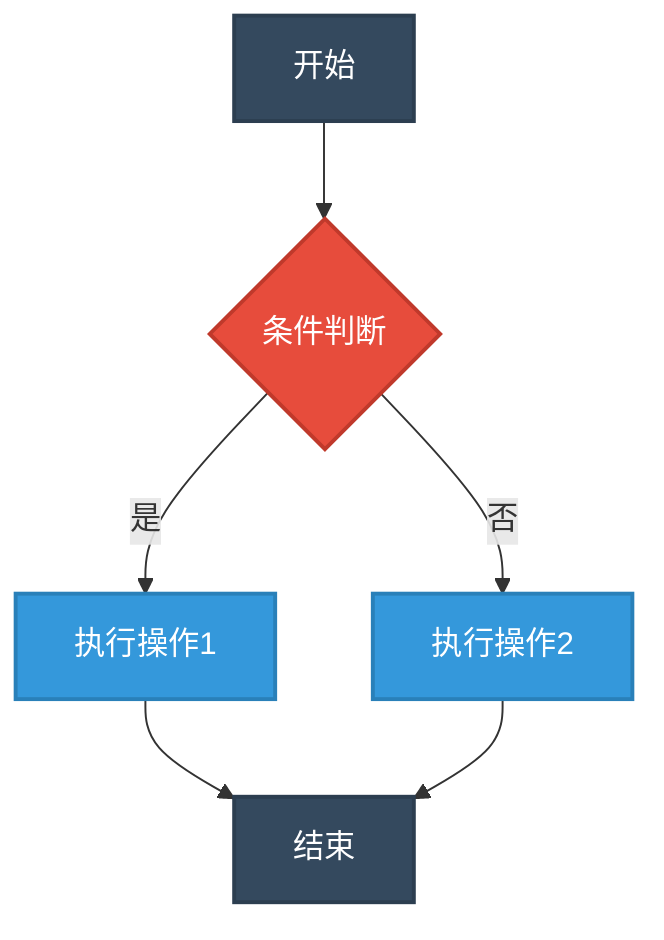
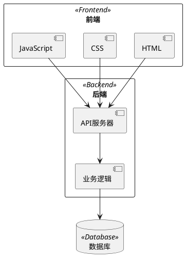
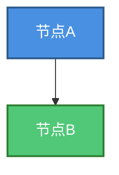
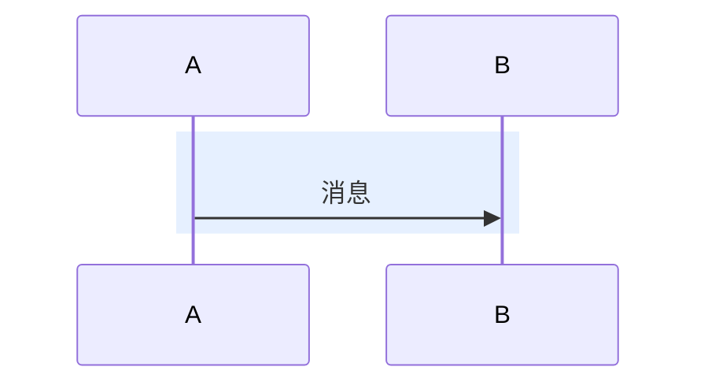
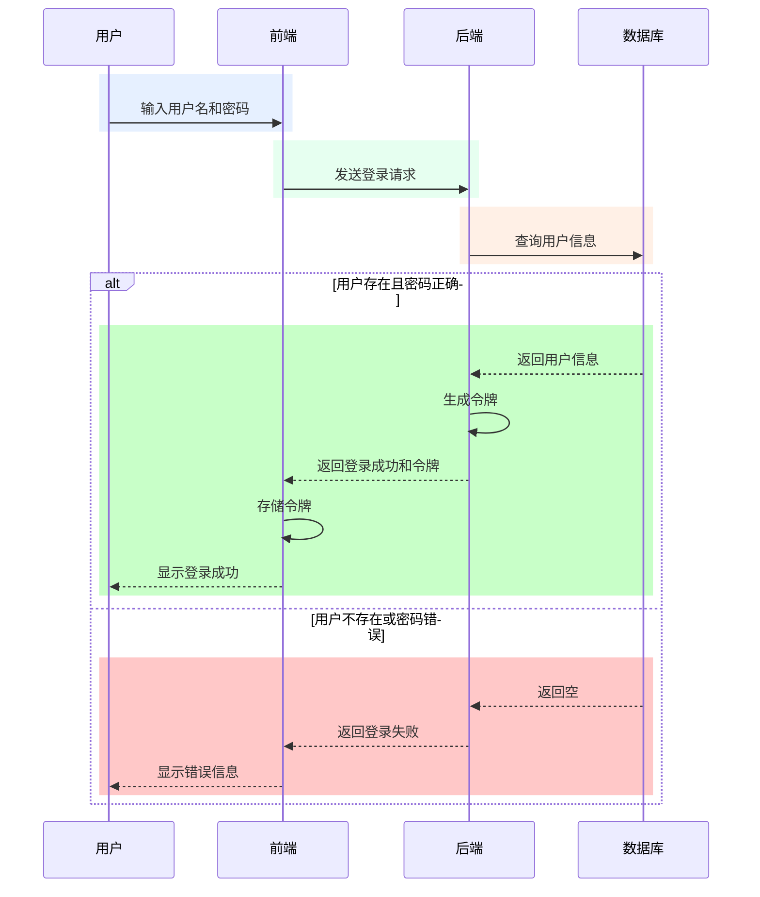
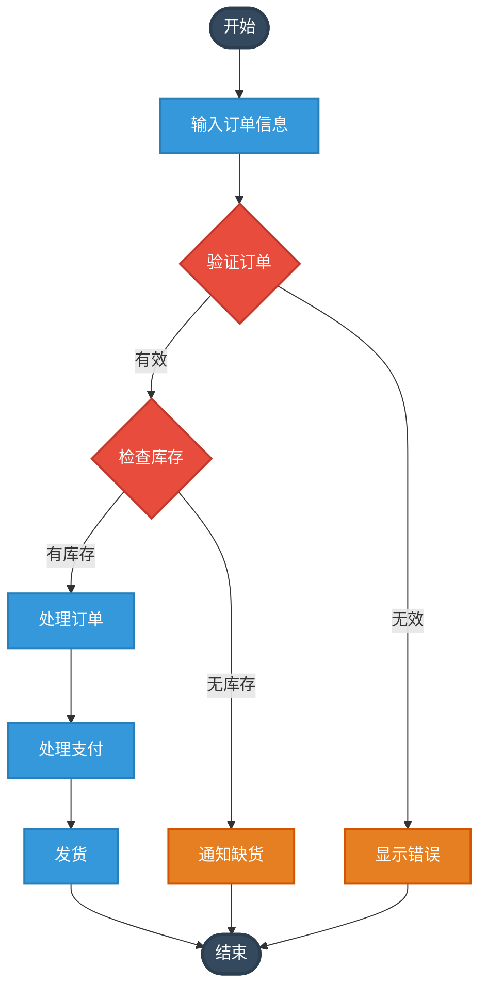
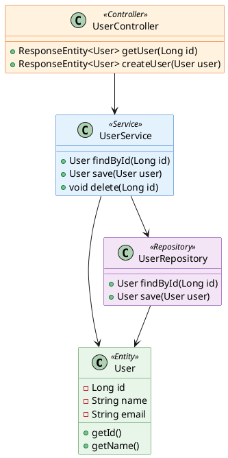

# 图表创建技能

## 概述

此技能用于创建各种类型的图表，帮助用户可视化复杂的信息和关系。根据图表类型和复杂度，提供不同的创建方案。

## 支持的图表类型

### 1. 时序图 (Sequence Diagrams)
- **用途**：展示对象之间按时间顺序的交互
- **推荐工具**：Mermaid 或 PlantUML
- **适用场景**：系统交互流程、API调用链、用户操作流程

### 2. 流程图 (Flowcharts)
- **用途**：展示决策过程和步骤顺序
- **推荐工具**：Mermaid、Flowchart 或 PlantUML
- **适用场景**：业务流程、算法步骤、工作流程

### 3. 架构图 (Architecture Diagrams)
- **用途**：展示系统组件及其关系
- **推荐工具**：PlantUML 或 draw.io
- **适用场景**：系统架构、网络拓扑、组件关系

### 4. 学习路线图 (Learning Roadmaps)
- **用途**：展示学习路径和知识结构
- **推荐工具**：draw.io
- **适用场景**：技能学习路径、课程规划、职业发展路线

## 工具选择指南

| 特性 | Mermaid | PlantUML | Flowchart | Graphviz | draw.io |
|------|---------|----------|-----------|----------|----------|
| 图表类型 | 流程图、时序图、甘特图等 | UML全系列、架构图 | 流程图 | 各类图表，极其灵活 | 几乎所有类型 |
| 语法难度 | 简单直观 | 中等，UML规范 | 非常简单 | 较复杂 | 图形化界面 |
| 生态支持 | GitHub/GitLab原生支持 | 需要插件支持 | 一般 | 广泛支持 | 独立工具 |
| 定制能力 | 中等 | 高 | 低 | 极高 | 极高 |
| 适用场景 | 日常文档配图 | 专业架构设计 | 简单流程说明 | 复杂网络拓扑 | 复杂图表设计 |
| 学习成本 | 低 | 中 | 极低 | 高 | 低 |

## 使用方法

### 1. 简单图表（Mermaid/PlantUML）

对于简单的时序图和流程图，使用Mermaid或PlantUML语法生成：

**Mermaid示例（时序图）：**


**Mermaid示例（流程图 - 带颜色）：**


**PlantUML示例（架构图 - 带颜色）：**


### 2. 复杂图表（draw.io）

对于复杂的架构图或学习路线图，使用draw.io格式生成：

**draw.io文件创建流程：**
1. 分析用户需求，确定图表类型和范围
2. 创建包含所有必要组件和关系的draw.io格式图表
3. 提供详细的节点和连接说明
4. 生成可编辑的draw.io XML格式内容

**draw.io XML示例结构：**
```xml
<mxGraphModel dx="1280" dy="800" grid="1" gridSize="10" guides="1" tooltips="1" connect="1" arrows="1" fold="1" page="1" pageScale="1" pageWidth="1920" pageHeight="1080" math="0" shadow="0">
  <root>
    <mxCell id="0"/>
    <mxCell id="1" parent="0"/>
    <!-- 节点和连接定义 -->
  </root>
</mxGraphModel>
```

## 详细指令

### ⚠️ 重要：颜色使用要求

**在生成任何 Mermaid 或 PlantUML 图表时，必须遵循以下要求：**

1. **必须使用颜色**：所有图表必须包含丰富的颜色定义，不能生成纯黑白的图表
2. **明显区分**：不同类型的类、组件、架构层次必须使用不同颜色明显区分
3. **语义化颜色**：颜色选择应符合语义（如绿色表示正常/服务，红色表示错误/数据，蓝色表示前端/接口）
4. **完整定义**：必须提供完整的颜色定义代码（classDef、skinparam、style等）
5. **视觉层次**：使用颜色的深浅变化表示层次关系

### 创建时序图

**步骤：**
1. 确定参与交互的对象/角色
2. 定义交互顺序和消息
3. **必须为不同类型的参与者使用不同颜色进行区分**
4. 使用Mermaid或PlantUML语法生成图表
5. 提供完整的代码示例（包含颜色定义）

**用户输入示例：**
"画一个用户登录系统的时序图，包含用户、前端、后端和数据库"

**颜色要求：**
- 用户/客户端：使用蓝色系
- 前端：使用绿色系
- 后端服务：使用橙色系
- 数据库：使用红色系

### 创建流程图

**步骤：**
1. 确定流程的开始和结束点
2. 识别所有中间步骤和决策点
3. **必须为不同类型的节点（开始/结束、决策、处理、数据存储等）使用不同颜色**
4. 使用Mermaid或Flowchart语法生成图表
5. 提供完整的代码示例（包含classDef颜色定义）

**用户输入示例：**
"画一个订单处理的流程图，包含订单提交、支付验证、库存检查和发货"

**颜色要求：**
- 开始/结束节点：深灰色
- 决策节点：红色系
- 处理节点：蓝色系
- 数据操作：橙色系

### 创建架构图

**步骤：**
1. 识别系统的主要组件
2. 定义组件之间的关系和依赖
3. **必须为不同层次的组件（前端、后端、数据层、中间件等）使用不同颜色明显区分**
4. 对于简单架构，使用PlantUML；对于复杂架构，使用draw.io
5. 提供完整的代码示例或draw.io XML（必须包含颜色定义）

**用户输入示例：**
"画一个微服务架构图，包含API网关、用户服务、产品服务和数据存储"

**颜色要求：**
- 前端层：蓝色系 (#4A90E2)
- API网关/中间件：紫色系 (#9B59B6)
- 业务服务：绿色系 (#50C878)
- 数据存储：红色/橙色系 (#FF6B6B 或 #F39C12)
- 外部服务：橙色系 (#F39C12)

### 创建学习路线图

**步骤：**
1. 确定学习目标和范围
2. 识别关键学习节点和顺序
3. 使用draw.io创建层次化的路线图
4. 提供draw.io XML格式内容

**用户输入示例：**
"画一个前端开发的学习路线图，从基础到高级"

## 输出格式

根据图表类型和复杂度，提供以下输出：

1. **简单图表**：直接在对话中提供Mermaid或PlantUML代码
2. **复杂图表**：提供draw.io XML格式内容，并说明如何导入到draw.io编辑器

## 色彩使用指南

### 核心原则
**必须使用丰富的色彩来区分不同的类、组件和架构层次**，确保图表具有良好的视觉区分度。

### Mermaid 颜色方案

**1. 流程图 (Flowchart) 颜色使用：**
- 使用 `classDef` 定义不同类别的样式
- 为不同类型的节点分配不同的颜色
- 使用 `class` 指令应用样式

**推荐颜色方案：**
- **前端组件**：`#4A90E2` (蓝色) - 表示用户界面层
- **后端服务**：`#50C878` (绿色) - 表示业务逻辑层
- **数据存储**：`#FF6B6B` (红色) - 表示数据层
- **网关/中间件**：`#9B59B6` (紫色) - 表示中间层
- **外部服务**：`#F39C12` (橙色) - 表示第三方服务
- **决策节点**：`#E74C3C` (深红) - 表示判断逻辑
- **开始/结束**：`#34495E` (深灰) - 表示流程边界

**2. 时序图 (Sequence Diagram) 颜色使用：**
- 使用 `activate` 和 `deactivate` 配合颜色高亮
- 为不同类型的参与者使用不同颜色
- 使用 `rect` 区域着色

**3. 架构图 (Architecture Diagram) 颜色使用：**
- 使用 `style` 指令为不同组件着色
- 按功能模块分组并使用统一颜色主题
- 使用渐变色增强视觉效果

### PlantUML 颜色方案

**1. 类图 (Class Diagram) 颜色使用：**
- 使用 `skinparam` 定义全局颜色主题
- 使用 `#颜色代码` 为类、包、关系着色
- 使用 `<<stereotype>>` 配合颜色区分不同类型的类

**推荐颜色方案：**
- **实体类 (Entity)**：`#E8F5E9` (浅绿背景) + `#2E7D32` (深绿边框)
- **服务类 (Service)**：`#E3F2FD` (浅蓝背景) + `#1565C0` (深蓝边框)
- **控制器 (Controller)**：`#FFF3E0` (浅橙背景) + `#E65100` (深橙边框)
- **数据访问 (DAO)**：`#F3E5F5` (浅紫背景) + `#6A1B9A` (深紫边框)
- **DTO/VO**：`#FCE4EC` (浅粉背景) + `#C2185B` (深粉边框)
- **配置类 (Config)**：`#FFF9C4` (浅黄背景) + `#F57F17` (深黄边框)

**2. 组件图 (Component Diagram) 颜色使用：**
- 使用 `package` 配合颜色分组
- 为不同层次的组件使用不同色系
- 使用 `cloud`、`database`、`queue` 等图标配合颜色

**3. 部署图 (Deployment Diagram) 颜色使用：**
- 使用 `node` 配合颜色区分不同环境
- 为不同类型的节点使用不同颜色
- 使用 `artifact` 配合颜色区分组件类型

### 颜色使用最佳实践

1. **一致性**：相同类型的组件使用相同的颜色
2. **对比度**：确保文字在背景色上清晰可读
3. **层次感**：使用深浅不同的同色系表示层次关系
4. **语义化**：颜色选择应符合常见的行业习惯（如绿色表示正常/成功，红色表示错误/警告）
5. **避免过多**：同一图表中颜色种类控制在 5-7 种以内

### 快速参考：颜色语法

**Mermaid 流程图颜色语法：**


**Mermaid 时序图颜色语法：**


**PlantUML 类图颜色语法：**

```plantuml
@startuml
skinparam class {
    BackgroundColor<<Type>> #颜色代码
    BorderColor<<Type>> #边框颜色
}
class MyClass <<Type>> {
}
@enduml
```


**PlantUML 组件图颜色语法：**

```plantuml
@startuml
skinparam component {
    BackgroundColor<<Type>> #颜色代码
    BorderColor<<Type>> #边框颜色
}
component [组件名] <<Type>>
@enduml
```


## 最佳实践

- **清晰简洁**：图表应简洁明了，避免过多细节
- **层次分明**：**必须使用丰富的颜色、分组和层次结构提高可读性，不同类、不同架构层次必须使用不同颜色明显区分**
- **色彩区分**：**为不同类型的组件、类、服务分配不同的颜色，确保视觉上能够快速识别和区分**
- **标注完整**：为关键组件和连接提供清晰的标注
- **格式一致**：保持图表风格和格式的一致性
- **易于维护**：选择适合后续修改的工具和格式

## 示例输出

### Mermaid时序图示例（带颜色）



### Mermaid流程图示例（带颜色）



### PlantUML类图示例（带颜色）



### draw.io架构图示例

```xml
<mxGraphModel dx="1280" dy="800" grid="1" gridSize="10" guides="1" tooltips="1" connect="1" arrows="1" fold="1" page="1" pageScale="1" pageWidth="1920" pageHeight="1080" math="0" shadow="0">
  <root>
    <mxCell id="0"/>
    <mxCell id="1" parent="0"/>
    <!-- API网关 -->
    <mxCell id="2" value="API网关" style="rounded=1;whiteSpace=wrap;html=1;fillColor=#4C8BF5;strokeColor=#2962FF;" vertex="1" parent="1">
      <mxGeometry x="400" y="100" width="200" height="60" as="geometry"/>
    </mxCell>
    <!-- 微服务 -->
    <mxCell id="3" value="用户服务" style="rounded=1;whiteSpace=wrap;html=1;fillColor=#4CAF50;strokeColor=#2E7D32;" vertex="1" parent="1">
      <mxGeometry x="200" y="250" width="160" height="60" as="geometry"/>
    </mxCell>
    <mxCell id="4" value="产品服务" style="rounded=1;whiteSpace=wrap;html=1;fillColor=#4CAF50;strokeColor=#2E7D32;" vertex="1" parent="1">
      <mxGeometry x="400" y="250" width="160" height="60" as="geometry"/>
    </mxCell>
    <mxCell id="5" value="订单服务" style="rounded=1;whiteSpace=wrap;html=1;fillColor=#4CAF50;strokeColor=#2E7D32;" vertex="1" parent="1">
      <mxGeometry x="600" y="250" width="160" height="60" as="geometry"/>
    </mxCell>
    <!-- 数据存储 -->
    <mxCell id="6" value="用户数据库" style="rounded=1;whiteSpace=wrap;html=1;fillColor=#FFA726;strokeColor=#EF6C00;" vertex="1" parent="1">
      <mxGeometry x="200" y="380" width="160" height="60" as="geometry"/>
    </mxCell>
    <mxCell id="7" value="产品数据库" style="rounded=1;whiteSpace=wrap;html=1;fillColor=#FFA726;strokeColor=#EF6C00;" vertex="1" parent="1">
      <mxGeometry x="400" y="380" width="160" height="60" as="geometry"/>
    </mxCell>
    <mxCell id="8" value="订单数据库" style="rounded=1;whiteSpace=wrap;html=1;fillColor=#FFA726;strokeColor=#EF6C00;" vertex="1" parent="1">
      <mxGeometry x="600" y="380" width="160" height="60" as="geometry"/>
    </mxCell>
    <!-- 连接 -->
    <mxCell id="9" value="" style="endArrow=block;html=1;" edge="1" parent="1" source="2" target="3">
      <mxGeometry relative="1" as="geometry"/>
    </mxCell>
    <mxCell id="10" value="" style="endArrow=block;html=1;" edge="1" parent="1" source="2" target="4">
      <mxGeometry relative="1" as="geometry"/>
    </mxCell>
    <mxCell id="11" value="" style="endArrow=block;html=1;" edge="1" parent="1" source="2" target="5">
      <mxGeometry relative="1" as="geometry"/>
    </mxCell>
    <mxCell id="12" value="" style="endArrow=block;html=1;" edge="1" parent="1" source="3" target="6">
      <mxGeometry relative="1" as="geometry"/>
    </mxCell>
    <mxCell id="13" value="" style="endArrow=block;html=1;" edge="1" parent="1" source="4" target="7">
      <mxGeometry relative="1" as="geometry"/>
    </mxCell>
    <mxCell id="14" value="" style="endArrow=block;html=1;" edge="1" parent="1" source="5" target="8">
      <mxGeometry relative="1" as="geometry"/>
    </mxCell>
  </root>
</mxGraphModel>
```

## 注意事项

- 对于非常复杂的图表，推荐使用draw.io以获得更好的编辑体验
- Mermaid图表在GitHub、GitLab等平台有原生支持
- PlantUML需要插件支持才能渲染
- 为确保图表质量，请提供清晰的需求描述和必要的上下文信息